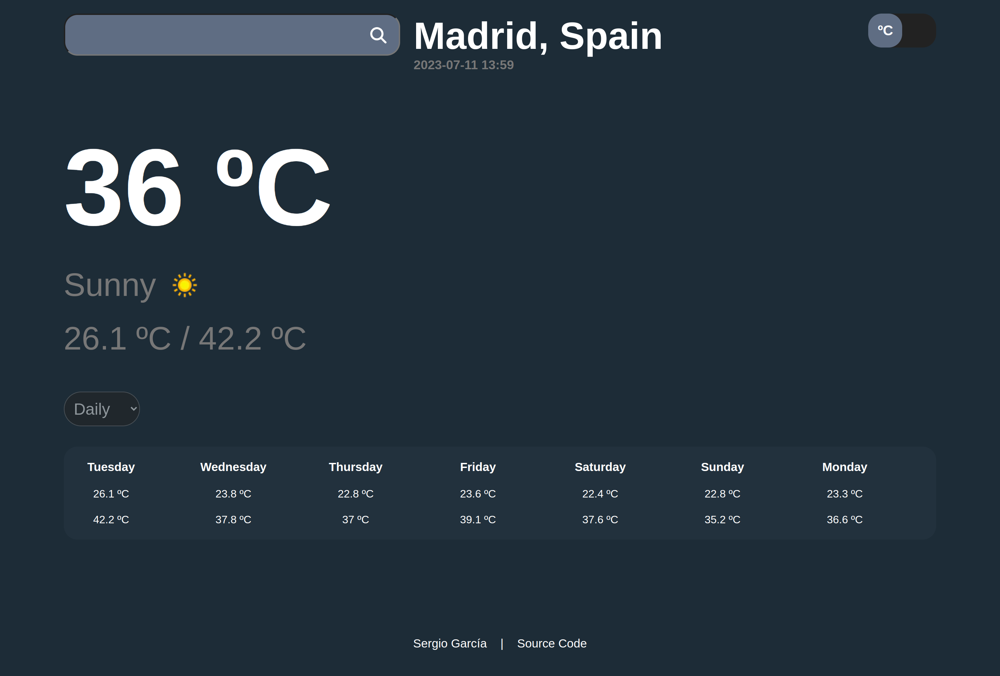

# Weather App

A weather app created with JavaScript

## About the App

The project is from [The Odin Project](https://www.theodinproject.com/lessons/node-path-javascript-weather-app) curriculum.

### Features

- Search any city.
- Change between Fahrenheit or Celsius.
- Show main data: temperature, min, max and condition.
- Daily and hourly forecast.
- Have responsive design.

### Tools and technology

- Visual Studio Code
- Linux Terminal
- Font Awesome Icons
- Figma
- Git and GitHub
- HTML and CSS
- JavaScript
- Webpack
- [Weather api](https://www.weatherapi.com/)

### Learnings

- Working with APIs
- Use of promises, async and await

## Screenshot

## Acknowledgements

- Project idea by [The Odin Project](https://www.theodinproject.com/)
- Web icon from [favicon](https://favicon.io/)

## Author

[Sergio García](https://github.com/sergiogarciiam)

## License

This project is open source and available under the [MIT License](./LICENSE).